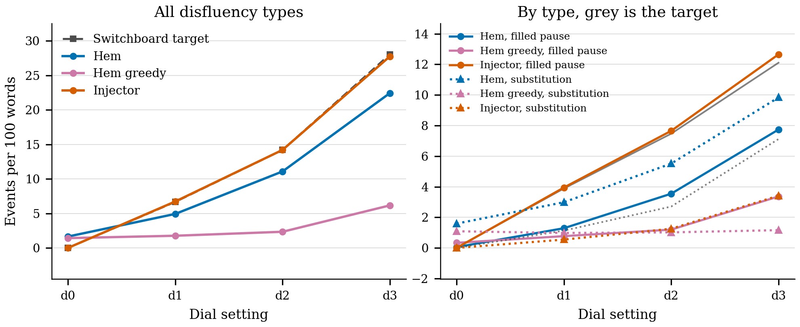
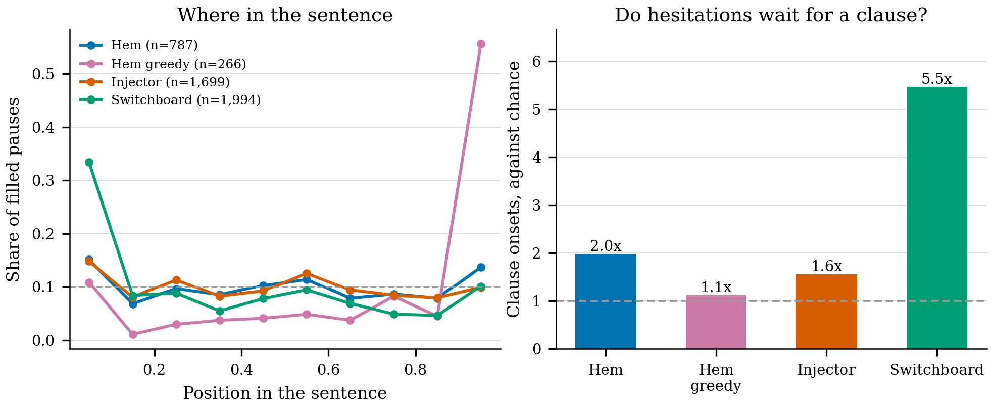
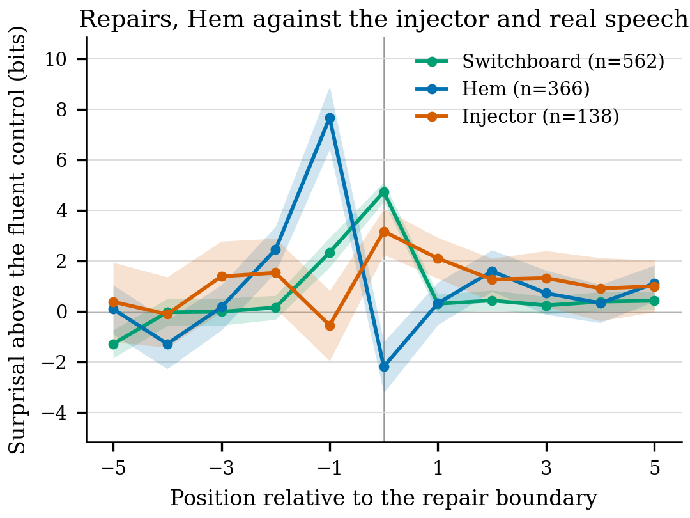

# Hem

[](https://github.com/daltonoscar0/hem/actions/workflows/tests.yml)

Hem turns clean scripted text into realistically disfluent speech, on a dial.

```
$ python -m hem --all-levels "Send the quarterly report to Sarah before Friday."
d0: send the quarterly report to sarah before friday
d1: send the quarterly report to you know sarah before friday
d2: send the quarterly report to to sarah before friday
d3: barry letter the quarterly report report to to sarah before before friday
```

That is the real output, `<d3>` included. The dial moves; it also turns *send*
into *barry letter*, which is the failure this README spends most of its length
on.

It is [Mend](https://github.com/daltonoscar0/mend) run backwards. Mend removes
filled pauses and self-repairs from dictation; Hem puts them back, at a rate you
choose, so a scripted voice sounds like a person talking.

The dial has four settings and none of their rates were chosen. They are
measured off the Switchboard Dialog Act corpus: `<d1>` is the median disfluent
utterance and below, `<d2>` runs from the median to the 90th percentile, `<d3>`
is the 90th percentile and above.

## The finding

**The rules win.** A rule-based injector with the same measured rates beats the
fine-tuned model on rate control, on script fidelity, on the round trip back
through Mend, and on type mix at two settings out of three.

The model wins on one thing, and it is the thing that was predicted:
**placement**. Shriberg's result is that hesitations cluster at clause onsets.
Real Switchboard speakers put a filled pause at a clause onset 5.5 times as
often as chance. The injector, which has an explicit rule telling it to do this,
manages 1.6 times chance. The model, which was told nothing and only read real
speech, manages 2.0 times.

| At d2, filled pauses | Clause onsets, against chance | Before a content word | Mid-clause, log freq of the next word |
|---|---|---|---|
| Switchboard | **5.5x** | 0.90x | 0.00 |
| Hem | **2.0x** | 1.26x | -0.72 |
| Injector | 1.6x | 1.65x | -1.12 |

Hem is closer to real speech than the injector on all three, and a long way from
it on the first. That is the whole of the model's advantage. Everything else in
this README is the injector winning, and the reasons are worth reading, because
they are mostly about what a 77M-parameter model does to a proper noun it has
never seen.

## The round trip

Hem writes a script out as speech, Mend reads it back as writing, and the
question is whether the script survives.

| Through | `<d0>` | `<d1>` | `<d2>` | `<d3>` |
|---|---|---|---|---|
| Mend after the injector | **0.868** | 0.796 | **0.709** | 0.603 |
| Mend after Hem | 0.747 | 0.583 | **0.403** | 0.251 |

Share of 1,200 held-out scripts recovered exactly, ignoring casing and
punctuation. Mend restores those from its own training distribution and a comma
in the wrong place is not a failure of the round trip.

Read the first cell first. **0.868 is the ceiling**: that is Mend reading back a
script with *nothing inserted at all*, so 13% of these sentences are lost to
Mend's own inversion error before any disfluency exists. Against that ceiling,
**the injector and Mend are inverses up to 0.71 at the natural setting**, which
is 82% of everything that was recoverable. Hem and Mend are inverses up to 0.40,
which is 46%.

For scale, Mend reading real Switchboard, the job it was actually trained for,
recovers 0.778.

## The dial

| Level | Switchboard utterances | Filled pause | Repetition | Substitution | Restart | All types | One event per |
|---|---|---|---|---|---|---|---|
| `<d0>` clean | 13,349 (38%) | 0.00 | 0.00 | 0.00 | 0.00 | 0.00 | n/a |
| `<d1>` light | 10,651 (30%) | 3.88 | 1.45 | 1.13 | 0.21 | 6.67 | 15 words |
| `<d2>` natural | 8,992 (26%) | 7.47 | 3.46 | 2.70 | 0.58 | 14.20 | 7 words |
| `<d3>` heavy | 2,216 (6%) | 12.11 | 7.41 | 7.12 | 1.43 | 28.06 | 4 words |
| all four | 35,208 (100%) | 3.93 | 1.81 | 1.49 | 0.30 | 7.52 | 13 words |

Events per 100 clean words. Regenerate with `python -m hem.rates`, which writes
`hem/levels.json`.

And the type mix at each setting, which is what the rates above come to as
proportions:

| Level | Filled pause | Repetition | Substitution | Restart |
|---|---|---|---|---|
| `<d1>` | 0.582 | 0.217 | 0.169 | 0.031 |
| `<d2>` | 0.526 | 0.243 | 0.190 | 0.041 |
| `<d3>` | 0.432 | 0.264 | 0.254 | 0.051 |

Substitutions take a larger share as the dial goes up, and hesitations a
smaller one. Speaking more disfluently is not the same as hesitating more.

### Two things the corpus disagreed with

The brief for this repo specified `<d1>` as **filled pauses only, about one per
20 words**. The corpus says the lightest half of disfluent Switchboard is 58%
filled pauses at one per 26 words. It still carries about one repetition per 70
words. The measurement is what is in the table.

The brief also implied `<d1>` should be cut as "filled pauses only" and `<d2>`
as "has a repetition or a substitution". Measured, that gives `<d1>` a filler
rate of 10.7 per 100 words against `<d2>`'s 3.6, because the first definition
guarantees a filler and the second does not. Turning that dial up would have
*removed* hesitations. It was not a length artefact: restricted to utterances of
10 to 25 words it still ran 8.9 against 3.9. The buckets are quantiles of the
total rate instead, which is monotone in all four types by construction, and
`test_levels.py` holds it there.

Only utterances of at least 10 clean words are used, for the measurement and for
training. Switchboard's short slash units are backchannels, and a per-word rate
computed over five words is quantised so coarsely that one filled pause already
reads as 20 events per 100 words. That halves the corpus and leaves 35,208.

## Rate control



| System | `<d0>` | `<d1>` | `<d2>` | `<d3>` |
|---|---|---|---|---|
| target | 0.00 | 6.67 | 14.20 | 28.06 |
| Injector | 0.00 | 6.73 | 14.21 | 27.77 |
| Hem | 1.65 | 4.93 | 11.09 | 22.44 |
| Hem, decoded greedily | 1.42 | 1.77 | 2.34 | 6.17 |

Events per 100 clean words over 1,200 held-out scripts, counted by the detector.

The injector lands on its target because it draws a count from the rate and
places that many, which is not much of an achievement but is the bar. Hem is
monotone and consistently short, at 0.74, 0.78 and 0.80 of target. It also
cannot be told to shut up: asked for `<d0>` it still inserts 1.65 events per 100
words, where the injector inserts none by construction.

### Greedy decoding destroys the dial

The bottom row is the same checkpoint decoded greedily, and it is the largest
single effect in this repo. Greedy was the first choice, on the reasoning that
sampling would let the rate be tuned after the fact with the temperature, and
the point of a control token is that the rate is something the model learned.

That reasoning was wrong, and not because of a bug. The model is a distribution
over ways of saying a sentence, and the single most likely way to say any
sentence is fluently: a filled pause has to go *somewhere*, and no one position
carries as much probability as inserting nothing. Greedy takes the mode and the
mode is nearly fluent.

| decode | `<d1>` | `<d2>` | `<d3>` | target at `<d2>` | script words lost |
|---|---|---|---|---|---|
| greedy | 1.77 | 2.34 | 6.17 | 14.20 | 1.2% to 2.2% |
| **sample, temperature 1** | **4.93** | **11.09** | **22.44** | 14.20 | 3.2% to 6.1% |
| sample, temperature 1.3 | 13.60 | 24.42 | 35.52 | 14.20 | 9.9% to 22.7% |

All three rows are the same checkpoint over the same 1,200 scripts.

Temperature 1 is not a tuned value, it is the absence of one, and `top_k` and
`top_p` are switched off for the same reason: any truncation of the tail is a
knob, and the point is to sample the distribution the model actually learned.
The third row is why it stays there. Pushing the temperature up does close the
remaining rate gap, and overshoots straight past it, while nearly quadrupling
the amount of the script that gets destroyed.

## Script fidelity

| System | `<d0>` | `<d1>` | `<d2>` | `<d3>` |
|---|---|---|---|---|
| Injector, script words kept | 1.000 | 1.000 | 1.000 | 1.000 |
| Hem, script words kept | 0.981 | 0.968 | **0.956** | 0.939 |
| Hem, sentences losing a word | 0.225 | 0.357 | **0.470** | 0.541 |

This is the column to read before using Hem on a script somebody has to say
verbatim. Hem is a generator, not an editor, and nothing stops it rewriting a
word instead of only adding to one. At the natural setting **nearly half of
sentences lose at least one word of the script**. The injector cannot do this:
it copies the clean tokens through and inserts around them.

## Type mix

Share of each level's events by type, in bits of KL from Switchboard measured
the same way:

| Level | Hem | Injector | detector floor |
|---|---|---|---|
| `<d1>` | 0.584 | **0.139** | 0.013 |
| `<d2>` | 0.335 | **0.158** | 0.027 |
| `<d3>` | **0.165** | 0.207 | 0.059 |

The floor is the same Switchboard utterances read from their gold spans instead
of through the detector, so it is the detector's own error and no system can
really be scored below it. The injector wins at the two lower settings and Hem
wins at the heavy one. The full table, with the four type shares for every row,
is in [`outputs/eval_tables.md`](outputs/eval_tables.md).

Hem's problem at `<d1>` and `<d2>` is that it produces far too many
substitutions: 0.61 of its events at `<d1>` against Switchboard's 0.20. The next
section is about where those come from.

## How much of that is a failure to copy

Given

> The match consisted of former professional players, as well as current
> professionals such as Leroy Lita, Nicky Shorey, Aaron McLean, Ray Parlour ...

Hem returns *leroy lisa*, *scott ferdinand*, *paul meerson*. Those are not
self-repairs. They are a 77M-parameter model failing to copy a name it has never
seen, and the detector cannot tell the difference: an inserted run that is not a
hesitation and not a repeat gets called a substitution, which is exactly what a
mangled name looks like.

Splitting the evaluation scripts on whether they contain a word absent from ten
million words of Switchboard, which in practice means a rare proper noun:

| System | Script | Sentences | Substitution rate | Script words kept |
|---|---|---|---|---|
| Hem | has an unseen word | 966 | **5.77** | 0.953 |
| Hem | every word seen | 234 | **3.91** | 0.979 |
| Injector | has an unseen word | 966 | 1.23 | 1.000 |
| Injector | every word seen | 234 | 1.38 | 1.000 |

The injector's rate does not move across the split, which is the control the
test needed: the split is not just picking out longer or harder sentences.

So copy failure is real and it is **partial**. On the scripts that name
something Switchboard has never heard of, it accounts for about 60% of the
excess over target: taking the unseen words away drops the substitution rate
from 5.77 to 3.91, against a target of 2.70. The other 40% is something else,
and it does not go away: even on scripts made entirely of words Switchboard
says, Hem substitutes at 1.4 times the rate it should. Reproduce with
`python -m hem.copyfail`.

Four fifths of the evaluation scripts contain such a word, which is a property
of the source rather than a choice: WikiText is an encyclopaedia and
encyclopaedias are mostly proper nouns. A cleaner reading of Hem's substitution
behaviour would need a corpus of scripted speech, which is exactly the thing
that does not exist and is why Mend built a generator in the first place.

## Placement



| Where filled pauses land | N | At a clause onset | Before a content word | Log freq of the next word | Same, mid-clause only |
|---|---|---|---|---|---|
| Hem | 787 | **0.215** (0.109) | 0.689 (0.545) | -4.08 (-3.60) | **-4.34** (-3.62) |
| Injector | 1,699 | **0.169** (0.109) | 0.899 (0.545) | -4.50 (-3.60) | **-4.74** (-3.62) |
| Switchboard | 1,994 | **0.786** (0.144) | 0.397 (0.440) | -2.67 (-2.71) | **-2.77** (-2.77) |

Each cell carries, in brackets, what it would be if the filled pause were
dropped in front of a word drawn uniformly from *that system's own text*. The
bracketed figure has to differ by row: Switchboard's transcribers comma far more
heavily than the scripted sentences do, and comparing raw onset shares across
the two would be measuring a transcriber's punctuation rather than a speaker's
hesitations. An earlier version of this table used one baseline for all three
rows and was wrong.

Two things fall out.

**The clause-onset effect is enormous and nobody comes close to it.** Real
speakers hesitate at clause onsets 5.5 times as often as chance. Hem reaches
2.0, the injector 1.6. The injector has an explicit rule telling it to prefer
clause onsets and content words, so this is not a strawman baseline; it is a
baseline that encodes half the literature and still loses to a model that was
told nothing.

**The low-frequency prediction does not replicate here at all.** The other half
of the standard result is that hesitations precede hard words. Asked of all
filled pauses, Switchboard's answer is confounded, because most of them sit at
clause onsets and the word after a clause onset is nearly always something like
*the* or *I*. Asked only of mid-clause hesitations, which is the question asked
properly, Switchboard's figure is -2.77 against a baseline of -2.77: **no effect
at all**, to two decimal places. Both generators strongly prefer rare words
mid-clause (Hem -0.72 below chance, the injector -1.12), and in doing so both
are wrong in the same direction. Hem is less wrong.

That may be a limitation of the measure rather than of the finding. Unigram
frequency of the single following word is a blunt instrument, and Shriberg's
result is about planning difficulty, which a following-word unigram does not
capture. What can be said is that on this corpus, with this measure, the effect
is not there, and any system tuned to produce it is being tuned towards
something the data does not show.

## Surprisal at repair points



Per-token surprisal from pythia-160m, summed within each whitespace word,
centred on the boundary token: the first token of the editing phrase, or of the
repair where there is none. Each window is differenced against **its own fluent
control**, the same sentence with the disfluency removed, read at the matching
word position. That pairing matters here more than it did in Mend: telephone
conversation and WikiText prose differ by bits before any disfluency is
inserted, and a plot of raw surprisal would show that difference rather than the
one being asked about.

| Source | n | Peak | At the boundary |
|---|---|---|---|
| Switchboard | 562 | +4.73 bits at **0** [+4.34, +5.12] | +4.73 |
| Injector | 138 | +3.17 bits at **0** [+2.25, +4.06] | +3.17 |
| Hem | 366 | +7.66 bits at **-1** [+6.42, +8.91] | **-2.18** [-3.21, -1.20] |

95% bootstrap intervals over 4,000 resamples of the paired per-instance
differences.

Real repairs put the surprise exactly on the interruption, which reproduces
Mend's result: +4.82 bits there against +4.73 here, on a different sample of the
same corpus (Mend drew from the whole parse, Hem from the held-out conversations
of at least 10 clean words). The injector does the same thing more weakly, and
one position later than Mend's injector managed, which is what the span-drop
repair buys: an abandoned phrase that is a shortened version of the real one
rather than a word pulled at random out of a category.

**Hem does something different in kind**: it
spikes 7.7 bits one word *early*, on the abandoned material, and then at the
interruption itself sits 2.2 bits *below* its own fluent control.

That is a signature, and it says the same thing the copy-failure table says.
Hem's abandoned word is far more surprising than a real speaker's, because a
real speaker abandons something they were plausibly about to say and Hem
abandons a mangled proper noun. Then, having already produced something in that
slot, the repair itself is easier than the fluent baseline. Hem is often not
self-repairing at all; it is rewriting, and the detector counts the rewrite as a
repair.

One caveat that cuts against Hem specifically. 221 of Hem's 587 candidate
windows were discarded because there is no matching position in the fluent
control, against 1 of 139 for the injector. Those are the sentences where Hem
dropped or reordered script words badly enough that the alignment stopped being
a prefix. So the 366 instances plotted are Hem's *better-behaved* output, and
the real picture is likely worse than the blue line.

## The detector

Model output carries no annotation, so every rate, mix and placement number in
this README is a count produced by `hem/detect.py`, which aligns the script
against the spoken text, reads the insertions off the alignment, and classifies
each one. It is the most load-bearing piece in the repo, so it is checked
against Switchboard's own spans rather than trusted:

```
$ python -m hem.detect --check
gold events        3008
detected events    3188
detection recall   0.928
detection precision0.876
type accuracy      0.879 of matched, 0.815 of gold
```

On 4,000 held-out utterances. Filled pauses are near exact (1,595 of 1,641).
Every table that compares a system against Switchboard also carries a
Switchboard row read from gold spans, so the reader can see the detector's own
error as a floor.

**Restarts are the exception and they are not usable.** The detector finds 1 of
83. Switchboard's restarts are mostly single cut-off words (*wh*, *ele*,
*becau*), and Mend's parser strips the trailing hyphen while building the
tokens, so they arrive indistinguishable from ordinary words. The parser was
left alone rather than fixed, because marking fragments would put material into
Hem's output that the shipped Mend model has never seen and would break the
round trip. The restart column exists in the tables for completeness. Do not
quote it.

One other bounded failure: a *delayed* repair emits its corrected word out of
script order, which the aligner reads as a deletion plus an insertion. On the
injector's own heaviest output, where nothing is ever really deleted, this
misfires on under 5% of sentences.

## The dial, on thirty sentences

Thirty held-out scripts at all four settings are in
[`outputs/qualitative.md`](outputs/qualitative.md). Four of them, chosen to show
the dial working and then failing:

```
Cherry credits the producers of Lost for the idea of the time jump.
 d0  cherry credits the producers of lost for the idea of the time jump
 d1  cherry credits the producers of lost for the idea of the time jump
 d2  cherry credits the producers of los uh lost for the idea of the time jump
 d3  cherry credits credits the producers of lost for the idea of the uh the time um jump

Confirm with Kevin that the small studio is free on Thursday.
 d0  confirm with kevin that the small studio is free on thursday
 d1  confirm with kevin that the small small studio is free on thursday
 d2  confirm with kevin that the small studio is is free in on thursday
 d3  confirm by kevin that the like small studio studio is free on on thursday
```

The first is the system working. *los uh lost* at `<d2>` is a real self-repair
shape, a speaker starting a word, breaking off and getting it right, and it is
not a shape the injector can produce at all. `<d3>` adds two repetitions and two
filled pauses without touching a word of the script. `<d1>` is identical to
`<d0>`, which is the rate shortfall showing up on a twelve-word sentence.

The second shows the cost creeping in. `<d2>` inserts a stray *in*, and `<d3>`
turns *confirm with Kevin* into *confirm by Kevin*, which is a rewrite of the
script and not a disfluency at all.

```
Producer Richard Stokes notes that it felt like we were organising a real
wedding but one that was being shot in about five different venues.
 d1  producer richard scotland notes that it felt uh like we were organising a
     real wedding but one that was being shot in about five different venues
 d3  producer richard scours notes notes that that it felt like we were
     organising a real wedding marriage but one that was being down in about 5
     uh different venues venues

The match consisted of ... such as Leroy Lita, Nicky Shorey, Aaron McLean, Ray
Parlour, Justin Edinburgh, Iain Dowie, Bob Dowie, Clive Allen, Scott Fitzgerald
and Paul Merson.
 d2  ... such as leroy lita nicky shorey aaron mcklean ray parlour uh uh vidain
     dowie bob dowie clive allen taylor david scott gilbert and paul merson
```

Line wrapping is this README's, the words are the model's. These are the
failure. *Richard Stokes* becomes *richard scotland*, then *richard scours*;
*shot* becomes *down*; *wedding* acquires *marriage*; *five* becomes *5*; and a
list of footballers comes back with *Justin Edinburgh* gone, *Scott Fitzgerald*
turned into *scott gilbert* and a *taylor david* invented from nothing. None of
this is disfluency.

## Where it fails

* **It cannot copy a rare name.** This is the dominant failure and it gets worse
  as the dial goes up, because sampling more means more chances to go wrong on a
  token the model has never seen. flan-t5-small has 77M parameters and a
  sentencepiece vocabulary built for general English; *Leroy Lita* is out of
  distribution and comes back as something else. Measured above: substitution
  rate 5.77 on scripts with an unseen word against 3.91 without.
* **It loses script words.** 4.4% of them at the natural setting, and at least
  one word in 47% of sentences. If the script has to be said verbatim, use the
  injector, which cannot do this.
* **`<d0>` does not mean silence.** Asked for the clean setting the model still
  inserts 1.65 events per 100 words. There is no way to ask the model for
  nothing; there is a way to ask the injector.
* **The register is American telephone conversation, and it shows.** The filled
  pauses are Switchboard's, weighted by how often Switchboard says them, so a
  formal or literary script comes back sounding like a phone call about car
  repairs. *you know* and *I mean* land particularly badly in written prose. This
  is not a bug in the model, it is what the training corpus is, but it means the
  output register is not adjustable.
* **Agreement is not repaired after a repair.** Neither generator fixes the
  grammar it breaks. *the small studio is is free in on thursday* leaves a
  stranded preposition; a substitution that changes number leaves the verb
  alone. Real speakers usually, though not always, fix this.
* **Restarts barely happen and cannot be measured anyway.** Hem produces them at
  0.12 per 100 words at `<d2>` against a target of 0.58, and the detector finds
  1 in 83 of the real ones, so neither the shortfall nor any correction to it
  can be trusted.
* **Rate control is 20% short and decoding does not fix it cheaply.** Raising
  the temperature to 1.3 does not close the gap so much as shoot past it (24.4
  against a target of 14.2 at the natural setting), and takes the script loss
  from 4.4% to 16.9% on the way.

None of these are fixed by more training. The first two are capacity: a larger
base model that can copy a proper noun would remove most of the substitution
excess and most of the fidelity loss at once, and that is the obvious next
experiment. It was not run, so this README does not claim it would work.

## Setup

```bash
uv venv --python 3.12 .venv
uv pip install -e ".[dev]"
```

Any environment with the pinned dependencies in `pyproject.toml` works. The
scripts pick their device automatically: CUDA if present, otherwise Apple MPS,
otherwise CPU.

## Using it

The trained model is on the Hub, so nothing needs training to try it:

```python
from transformers import AutoModelForSeq2SeqLM, AutoTokenizer

model = AutoModelForSeq2SeqLM.from_pretrained("daltonoscar0/hem-flan-t5-small")
tok = AutoTokenizer.from_pretrained("daltonoscar0/hem-flan-t5-small")

ids = tok("<d2> say aloud: Send the report to Sarah by Friday.", return_tensors="pt")
out = model.generate(**ids, max_new_tokens=192,
                     do_sample=True, temperature=1.0, top_k=0, top_p=1.0)
print(tok.decode(out[0], skip_special_tokens=True))
```

The input format is not optional: a control token, then `say aloud: `, then the
clean written sentence. The four control tokens were added to the tokenizer as
special tokens during fine-tuning, so a tokenizer loaded from anywhere else will
split `<d2>` into four pieces and the dial will not work. Sampling is not
optional either; see the greedy row above.

From the command line:

```console
$ python -m hem --level 2 "Send the quarterly report to Sarah before Friday."
send the quarterly report to to sarah before friday

$ python -m hem --level 2 --trace "Send the quarterly report to Sarah before Friday."
send the quarterly report to to sarah before friday
  repetition   at 5    before clean word 5    'to'

$ python -m hem --level 3 --rules "Send the report to Sarah."   # the baseline
$ python -m hem --all-levels "Send the report to Sarah."        # the dial, all four
$ python -m hem --levels                                        # what the dial means
$ python -m hem --eval                                          # the evaluation
```

`--trace` runs the detector over the generated text rather than asking the
generator what it did, so it says the same thing about model output and rule
output, and the insertions it lists are the ones the evaluation counts. It reads
stdin when given no arguments, one line in, one line out, so it works in a pipe.

`--rules` swaps in the rule-based injector, which needs no checkpoint and, on
most of the numbers above, is the better system.

## Running the stages

```bash
# 1. tests: no checkpoint and no corpus download needed
pytest

# 2. real speech (14 MB, no licence gate)
curl -L -o swda.zip https://github.com/cgpotts/swda/raw/master/swda.zip
unzip -q swda.zip -d swda
python -m hem.swda --root swda --out data/swda_all.jsonl --split

# 3. measure the corpus and write the dial into hem/levels.json
python -m hem.rates --data data/swda_all.jsonl

# 4. check the detector against the corpus's own spans
python -m hem.detect --check

# 5. training pairs: 50k/2k/10k synthetic, plus the real pairs relabelled
python -m hem.build_data --smoke                    # 120 pairs, prints a sample
python -m hem.build_data --train 50000 --val 2000 --test 10000 --seed 13

# 6. fine-tune; writes <out>/checkpoints and links <out>/model at the best one
python -m hem.train --smoke --smoke-steps 150 --batch 32 --real 25000
python -m hem.train --batch 32 --epochs 2 --eval-steps 500 --real 25000
#   --resume auto picks up from the latest checkpoint if a run is interrupted

# 7. the evaluation: rate control, fidelity, type mix, placement, both figures
python -m hem.evaluate --limit 1200 --swda-limit 6000
python -m hem.roundtrip        # separate process; see below
python -m hem.copyfail         # copy failure against self-repair, no model
python -m hem.surprisal --draws 4000
```

Every stage is seeded and re-runnable.

Two operational notes, both learned the hard way on a 16 GB machine. The round
trip is a separate command because loading Mend while two Hem checkpoints and
their MPS decode buffers are still resident got the evaluation killed by the
system twice, with no traceback. And do not run the test suite next to training:
the MPS allocator keeps a pool per tensor shape and never releases it, MPS
allocations do not show up in RSS, and the first full run degraded from 1.5 to
25 seconds per step with the training process apparently using 137 MB. Trimming
the cache every 25 steps and leaving the machine alone fixed it.

The test suite builds its own data, reads the dial from the checked-in
`hem/levels.json`, and stubs the language model, so it runs on a fresh clone in
under a second and needs no GPU. 243 tests cover the injector, the SwDA parser,
the rate measurement, the dial, the detector, the training mix, the scoring
functions, the surprisal windowing and the command line. `train.py`'s loop is
not covered; it is a thin wrapper over `Seq2SeqTrainer` and produces no reported
number.

## How it was trained

flan-t5-small, the same base model and size as Mend so the two are comparable.
50,000 synthetic pairs from the injector plus 24,619 real Switchboard utterances
read backwards (33% real), 2 epochs, batch 32, learning rate 5e-5, 4,664 steps.
Validation loss 0.632 to 0.499, best checkpoint step 4,000. About two hours and
ten minutes of wall clock on an M4, across a run that was interrupted at step
1,294 and resumed from 1,000 to clear the MPS allocator.

Every training pair is labelled by **its own measured rate**, not by the setting
it was generated at. The injector is stochastic, so a sentence asked for at
`<d3>` sometimes comes out light, and keeping the asked-for label would teach
the model that `<d3>` sometimes means light. Both sources go through the same
measurement, so the control token means exactly one thing on both sides of the
mix.

## Layout

```
hem/rates.py       measures Switchboard, writes hem/levels.json and the unigram table
hem/levels.py      the dial: control tokens, target rates, injector settings
hem/injector.py    the rule-based baseline, driven by per-100-word rates
hem/swda.py        Switchboard transcripts to annotated pairs, carried over from Mend
hem/corpus.py      the clean scripted sentence pool, carried over from Mend
hem/build_data.py  (clean, disfluent) pairs from both sources, labelled by measured rate
hem/train.py       the seq2seq fine-tune
hem/generate.py    the two generators behind one interface
hem/detect.py      recovers insertions from output alone, and its check against gold
hem/evaluate.py    rate control, fidelity, type mix, placement, both tables and figures
hem/roundtrip.py   Mend over Hem's output, as its own process
hem/copyfail.py    how much of the substitution rate is a failure to copy
hem/surprisal.py   surprisal at repair points, the figure
hem/__main__.py    the command line
hem/levels.json    the measured dial, checked in so nothing needs the corpus
outputs/           tables, figures, the thirty-sentence table, the generations
DECISIONS.md       one line per engineering decision, including the wrong ones
```

## Licence

MIT.
